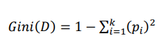
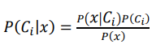
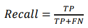

# 读书笔记（张辉）

## 书名: 《机器学习精讲》 
## 作者: Andriy Burkov

### 总体概述
这本书介绍了机器学习和深度学习的基本原理，以及如何应用它们解决实际问题。俗话说，书读百遍，其义自见。虽然说之前已经读过一次，但是为了做读书笔记以及相关的机器学习小项目重新温习一次，希望可以有不一样的体验。

### 每章内容

#### 第一章: 绪论
- **摘要**: 机器学习致力于研究如何利用代表某现象的样本数据构建算法。今天在bilibili看到北京大学统计学王汉生教授的一门课《统计学研究什么？》，里面说到统计学就是研究不确定性的一门学科，而机器学习就是研究不确定性的一种工具，从统计方法中来，再应用到统计研究中去。
- **学习的类型**
  - **监督学习**:有x，有y，通过学习得到一个函数f(x)，使得f(x)尽可能接近y。
  - **非监督学习**: 只有x。
  - **半监督学习**: 有x，有部分y。
  - **强化学习**: 模拟人类学习行为，通过奖励和惩罚来训练模型。


#### 第二章: 符号和定义
- **摘要**: 数学符号，我将记录我不熟悉的符号和定义，方便以后使用。
- **数据结构**
  - **点积**：点积是两个向量的内积，表示两个向量的夹角。是一个标量.
  - **函数**: argmaxf(a)则返回使f(a)最大的元素a.
  - **梯度**:有多个输入变量的函数，其梯度是一个向量，表示函数对每个输入变量的偏导数。
- **随机变量**
  - **贝叶斯准则**: P(A|B) = P(B|A)P(A)/P(B)
  - **参数估计**: 极大似然估计: 极大似然估计是寻找参数使得似然函数的最大值。
  - **梯度下降**: 梯度下降是寻找函数最小值的一种方法，通过不断更新参数来寻找最小值。

#### 第三章: 基本算法
- **摘要**:5种常见的机器学习算法，包括决策树、支持向量机、朴素贝叶斯、K近邻和逻辑回归。
###### 3.1 线性回归

###### 3.1.1 问题陈述
线性回归是一种用于建模因变量与一个或多个自变量之间关系的统计方法。其目标是通过最小化误差平方和来找到最优的线性模型。在线性回归中，我们假设因变量 y 和自变量 x 之间存在线性关系，即 y = β0 + β1 x + ε，其中 β0 和 β1 是模型参数，ε 是误差项。

###### 3.1.2 解决方案
###### 最小二乘法
最小二乘法通过最小化所有样本点的预测值和实际值之间的误差平方和来估计模型参数。具体步骤如下：
1. 定义损失函数 L(β0, β1) = Σ(y_i - (β0 + β1 x_i))^2。
2. 通过对损失函数求偏导数并令其等于零，得到参数的解析解。

###### 梯度下降法
梯度下降法通过迭代优化来逼近最优解。具体步骤如下：
1. 初始化参数 β0 和 β1。
2. 计算损失函数对参数的梯度。
3. 更新参数 β0 和 β1。
4. 重复步骤2和3，直到损失函数收敛。

###### 3.2 对数几率回归

###### 3.2.1 问题陈述
对数几率回归（Logistic Regression）是一种用于二分类问题的统计方法。其基本思想是通过对数几率函数将线性回归的输出映射到(0, 1)区间。具体地，对数几率回归模型假设因变量 y 和自变量 x 之间存在如下关系： P(y=1|x) = 1 / (1 + exp(-(β0 + β1 x)))，其中，β0 和 β1 是模型参数。

###### 3.2.2 解决方案
###### 最大似然估计
最大似然估计（MLE）通过最大化似然函数来找到最优参数。具体步骤如下：
1. 定义似然函数 L(β0, β1)。
2. 对似然函数取对数，得到对数似然函数。
3. 通过优化对数似然函数，找到最优参数。

###### 梯度下降法
与线性回归中的梯度下降法类似，对数几率回归的参数也可以通过梯度下降法迭代优化。具体步骤如下：
1. 初始化参数 β0 和 β1。
2. 计算对数似然函数对参数的梯度。
3. 更新参数 β0 和 β1。
4. 重复步骤2和3，直到对数似然函数收敛。

###### 3.3 决策树学习

###### 3.3.1 问题陈述
决策树是一种用于分类和回归的树形模型，其基本思想是通过递归地将数据划分为子集，从而生成一个树状结构。决策树通过一系列的决策节点和叶节点来表示数据的分类规则。

###### 3.3.2 解决方案
###### ID3算法
ID3算法通过信息增益来选择最优的划分属性。具体步骤如下：
1. 计算每个属性的信息增益。
2. 选择信息增益最大的属性作为划分属性。
3. 根据划分属性的不同取值，递归地构建子节点。
4. 重复步骤1到3，直到所有样本都被正确分类或没有更多属性可以选择。

###### C4.5算法
C4.5算法是ID3算法的改进版，通过增益率来选择最优的划分属性。具体步骤如下：
1. 计算每个属性的增益率。
2. 选择增益率最大的属性作为划分属性。
3. 根据划分属性的不同取值，递归地构建子节点。
4. 重复步骤1到3，直到所有样本都被正确分类或没有更多属性可以选择。

###### CART算法
CART算法通过基尼指数来选择最优的划分属性，适用于分类和回归任务。具体步骤如下：
1. 计算每个属性的基尼指数。
2. 选择基尼指数最小的属性作为划分属性。
3. 根据划分属性的不同取值，递归地构建子节点。
4. 重复步骤1到3，直到所有样本都被正确分类或没有更多属性可以选择。

###### 3.4 支持向量机

###### 3.4.1 处理噪声
支持向量机（SVM）是一种用于分类和回归的监督学习模型，其基本思想是通过寻找最优的超平面来最大化类间间隔。对于线性不可分的数据，SVM引入了软间隔，通过允许一定的误分类来处理噪声。

###### 软间隔SVM
软间隔SVM通过引入松弛变量来允许一定的误分类，优化目标变为：最小化 1/2 * ||w||^2 + C * Σξ_i，其中 w 是权重向量，ξ 是松弛变量，C 是惩罚参数。

###### 3.4.2 处理固有非线性
为了处理非线性问题，SVM引入了核技巧，通过将输入数据映射到高维空间，使得在该空间中线性可分。

###### 核函数
常见的核函数包括：
- 线性核： K(x_i, x_j) = x_i · x_j
- 多项式核： K(x_i, x_j) = (x_i · x_j + c)^d
- 高斯核： K(x_i, x_j) = exp(-||x_i - x_j||^2 / (2σ^2))

###### 3.5 k近邻

###### 问题陈述
k近邻算法（kNN）是一种简单而有效的非参数分类方法，其基本思想是通过计算样本点与训练集中的k个最近邻样本之间的距离来进行分类。kNN算法的假设是相似的样本具有相似的标签。

###### 解决方案
###### kNN分类算法
具体步骤如下：
1. 选择距离度量（如欧氏距离、曼哈顿距离）。
2. 计算待分类样本与训练集中的所有样本之间的距离。
3. 根据距离从小到大排序，选择距离最近的k个样本。
4. 根据k个最近邻样本的标签进行投票，选择出现次数最多的标签作为待分类样本的预测标签。

###### kNN回归算法
kNN算法也可以用于回归任务。具体步骤如下：
1. 选择距离度量。
2. 计算待预测样本与训练集中的所有样本之间的距离。
3. 根据距离从小到大排序，选择距离最近的k个样本。
4. 计算k个最近邻样本的平均值或加权平均值作为待预测样本的预测值。
以下是一个手写的线性回归的代码：
```python
import numpy as np
def mean(values):
    return sum(values) / float(len(values))
def variance(values, mean):
    return sum([(x-mean)**2 for x in values])
def covariance(x, mean_x, y, mean_y):
    covar = 0.0
    for i in range(len(x)):
        covar += (x[i] - mean_x) * (y[i] - mean_y)
    return covar
# 线性回归算法
def simple_linear_regression(train, test):
    predictions = list()
    x_train, y_train = zip(*train)
    x_test, y_test = zip(*test) 
    # 计算均值
    x_mean, y_mean = mean(x_train), mean(y_train) 
    # 计算b1
    b1 = covariance(x_train, x_mean, y_train, y_mean) / variance(x_train, x_mean)
    # 计算b0
    b0 = y_mean - b1 * x_mean
    # 使用回归方程预测
    for x in x_test:
        y_pred = b0 + b1 * x
        predictions.append(y_pred)
    return predictions
# 测试数据
dataset = [(1, 2), (2, 3), (4, 3), (3, 2), (5, 5)]
testset = [(6, None), (7, None)]
# 进行预测
predictions = simple_linear_regression(dataset, testset)
# 输出预测结果
for i in range(len(predictions)):
    print('Predicted=%.3f' % predictions[i])
```

#### 第四、五、六章: 实践应用
- **摘要**: 在假期做了一个机器学习的项目，也就是我毕业设计的延申，主要是使用机器学习算法预测石油井的漏失问题。我整个项目就是使用本书介绍的第四、五、六章步骤完成的，也是使用了书中的方法解决了实际操作中遇到的问题，以达到融会贯通，实践和理论两条腿向前。

- **第一步：收集数据**:将我们研究的问题的数据收集到一起，并进行整理和整理，构建一个数据集。特征工程就是将数据转换为适合机器学习的形式，在本例中我将是否漏失作为标签，其他变量作为特征。

- **第二步：准备数据**:首先要将字符串（文字/特性）变量等特征进行独热编码：比如不同的地层对应不同数字。
**M层=[1,0,0]
A层=[0,1,0]
B层=[0,0,1]** 然后是数据清洗，数据预处理，对于缺失特征我们有以下三种处理手段:
1、将缺失的数据补全，比如用均值或者中位数来填充缺失值；或者有另外一种更好的方法，比如将缺失的值当作一个回归问题的目标变量用最近邻算法来填充缺失值，或者使用深度学习算法来预测缺失值。以下是使用平均值替代的公式：


2、将含有缺失特征的样本从数据集中删除，我就是使用的这种方法。
3、选择一种可以处理缺失特征值的学习算法。
数据归一化和标准化：归一化就是将数据缩放到0-1之间，使数据具有相同的比例。将输入值控制在一个相同的、较小的范围内，可以避免在计算中遇到数值极小或者极大的问题（数值溢出）。


下面是我使用上述的数据处理的方法对数据进行处理的python代码以及结果展示：
```python
import matplotlib.pyplot as plt
import seaborn as sns
from sklearn.preprocessing import MinMaxScaler
import pandas as pd
# 设定中文字体
plt.rcParams['font.sans-serif'] = ['SimHei']  # 使用黑体
plt.rcParams['axes.unicode_minus'] = False  # 解决负号显示问题

# Load the Excel file
file_path = '0.01.xlsx'
xls = pd.ExcelFile(file_path)

# Check sheet names
sheet_names = xls.sheet_names
sheet_names

# Function to process each sheet
def process_sheet(sheet_name):
    # Load the sheet into a DataFrame
    df = pd.read_excel(file_path, sheet_name=sheet_name)

    # Identify columns to exclude from normalization
    exclude_columns = ['index', '井名', 'X', 'Y', '漏失深度', '漏失量', '漏失地层', '年份','数据类型（点对点是0，线对点是1）','depth']
    columns_to_normalize = [col for col in df.columns if col not in exclude_columns]

    # Record original ranges
    original_ranges = df[columns_to_normalize].agg(['min', 'max']).transpose()

    # Normalize the columns
    scaler = MinMaxScaler()
    df_normalized = df.copy()
    df_normalized[columns_to_normalize] = scaler.fit_transform(df[columns_to_normalize])

    # Record normalized ranges
    normalized_ranges = df_normalized[columns_to_normalize].agg(['min', 'max']).transpose()

    # Generate ifloss column
    df_normalized['ifloss'] = df['漏速m3/h'].apply(lambda x: 0 if x == 0 else 1)

    # Plot boxplots for original and normalized data
    plt.figure(figsize=(15, 7))

    plt.subplot(1, 2, 1)
    sns.boxplot(data=df[columns_to_normalize])
    plt.title(f'Original Data Boxplot - {sheet_name}')
    plt.xticks(rotation=90)

    plt.subplot(1, 2, 2)
    sns.boxplot(data=df_normalized[columns_to_normalize])
    plt.title(f'Normalized Data Boxplot - {sheet_name}')
    plt.xticks(rotation=90)

    plt.tight_layout()
    plt.show()

    # Return the processed DataFrame and range data
    return df_normalized, original_ranges, normalized_ranges


# Process the "插值" sheet
df_normalized_1, original_ranges_1, normalized_ranges_1 = process_sheet('插值')

# Process the "不插值" sheet
df_normalized_2, original_ranges_2, normalized_ranges_2 = process_sheet('不插值')

df_normalized_1.head(), original_ranges_1, normalized_ranges_1
# Save the normalized data to new Excel sheets
output_file_path = f'normalized_data{file_path[:-5]}.xlsx'

# Write the results to a new Excel file
with pd.ExcelWriter(output_file_path) as writer:
    df_normalized_1.to_excel(writer, sheet_name='插值_归一化', index=False)
    df_normalized_2.to_excel(writer, sheet_name='不插值_归一化', index=False)


```


我们可以看到经过处理的数据的范围都在0-1之间，归一化完成。再然后就是数据降维，处理不平衡数据，筛选特征，数据可视化。以下是《机器学习精讲》提供的如何处理不平衡数据的方法：


除了使用这两种方法还可以使用k折验证法，交叉验证法等对数据进行分割，消除了不平衡的数据。然后就是对数据的筛选和可视化，以及数据降维。我们先使用相关性检验，验证和漏失y相关性为正的特征变量，其他变量都删除。然后再对剩下的变量使用PCA，以下是的代码:
```python
import pandas as pd
import numpy as np
import matplotlib.pyplot as plt
from sklearn.decomposition import PCA
from sklearn.preprocessing import StandardScaler
from openpyxl import load_workbook
# 设定中文字体
plt.rcParams['font.sans-serif'] = ['SimHei']  # 使用黑体
plt.rcParams['axes.unicode_minus'] = False  # 解决负号显示问题
# 读取Excel文件中的两个Sheet
file_path = 'normalized_data0.01.xlsx'
sheet_names = ['插值_归一化', '不插值_归一化']

# 忽略的列名
ignore_columns = ['index', '井名', 'X', 'Y', '漏失地层', '年份','depth','ifloss','漏速m3/h']


# 读取数据并处理
data_sheets = {sheet: pd.read_excel(file_path, sheet_name=sheet) for sheet in sheet_names}

# 处理每个Sheet
for sheet_name, data in data_sheets.items():
    # 将ifloss当作目标变量
    y = data['ifloss']

    # 剔除不需要的列
    features = data.drop(columns=ignore_columns)

    # 计算相关性
    correlation = features.corrwith(y)

    # 去掉负相关的特征
    positive_correlation_features = correlation[correlation > 0].index
    filtered_features = features[positive_correlation_features]

    # 标准化特征
    scaler = StandardScaler()
    scaled_features = scaler.fit_transform(filtered_features)

    # 进行PCA
    pca = PCA()
    pca_features = pca.fit_transform(scaled_features)

    # 选择累计解释方差大于某个比例的主成分（例如90%）
    explained_variance_ratio = pca.explained_variance_ratio_
    cumulative_variance_ratio = np.cumsum(explained_variance_ratio)
    n_components = np.argmax(cumulative_variance_ratio >= 0.9) + 1
    selected_pca_features = pca_features[:, :n_components]

    # 将PCA特征加入到原数据中
    for i in range(n_components):
        data[f'PCA_{i + 1}'] = selected_pca_features[:, i]

    # 输出相关性图
    plt.figure(figsize=(10, 6))
    plt.bar(positive_correlation_features, correlation[positive_correlation_features])
    plt.title(f'Feature Correlation with ifloss - {sheet_name}')
    plt.xlabel('Features')
    plt.ylabel('Correlation')
    plt.xticks(rotation=90)
    plt.show()

    # 输出PCA解释方差图
    plt.figure(figsize=(10, 6))
    plt.plot(range(1, len(explained_variance_ratio) + 1), cumulative_variance_ratio, marker='o')
    plt.axhline(y=0.9, color='r', linestyle='--')
    plt.title(f'Cumulative Explained Variance by PCA - {sheet_name}')
    plt.xlabel('Number of Components')
    plt.ylabel('Cumulative Explained Variance')
    plt.show()

    # 保存处理后的数据到新的Excel
    output_file_path = f'processed_data{file_path[:-5]}.xlsx'
    if sheet_name == sheet_names[0]:
        # 如果是第一个Sheet，创建新的Excel文件
        data.to_excel(output_file_path, sheet_name=sheet_name, index=False)
    else:
        # 如果不是第一个Sheet，追加到已有的Excel文件中
        with pd.ExcelWriter(output_file_path, engine='openpyxl', mode='a') as writer:
            data.to_excel(writer, sheet_name=sheet_name, index=False)

print(f"处理后的数据已保存到 {output_file_path}")
```
结果是：


- **第三步：选择学习算法** 在选择学习算法之前，我们先划分样本。我们通常将带有标签样本划分为3种类型：训练集、验证集和测试集。训练集用于训练模型，验证集用于调整超参数，测试集用于评估模型的性能。这里推荐使用全部数据的70%的数据作为训练集，15%的数据作为测试集，15%的数据作为验证集。
最后，在验证集上测试来选择我们最合适的算法。由于我们有相关的经验，所以本次实验我们选择了决策树算法，神经网络算法，以及贝叶斯估计算法，MDN算法，下面我将着重介绍这些算法：

- **决策树算法**:决策树算法是一种常用于分类问题的监督学习方法。它是一种基于树状结构的模型，通过一系列的决策节点来分割数据集，最终将数据划分为不同的类别或预
测数值。决策树的核心思想是根据数据的特征属性逐步进行决策，直到达到预定的目标。本例基于基尼不纯度（Gini Impurity）选择最佳特征来划分数据集，它表示从数据集中随机选择两个样本，它们不属于同一类别的概率。基尼不纯度的数学公式如下：

- 

其中，𝐷是数据集，𝑘是类别的数量，𝑝𝑖是第𝑖个类别在数据集𝐷中的比例。决策树分类算法具有可解释性，同时不需要大量数据预处理。相对于其他算法，决策树对数据的缺失值和异常值不太敏感，不需要太多的数据预处理工作。但是，如果数据比较复杂或者数据类别不平衡时，决策树会出现过拟合的现象或者偏向于具有更多样本的类别。本例中，关井时刻数据远远小于开井时刻数据，所以需要格外关注召回率。

- **神经网络算法**:神经网络作为一种先进的机器学习技术，擅长捕捉输入与输出间的非线性关联，成为分析复杂数据关系的得力助手。它不仅普及于众多工程挑战，如预测泥浆流失问题，并且通过整合不确定性考量，能更精细地描绘泥浆流失率的可能变化范围，提升预测的实用性。借鉴生物神经系统，神经网络擅长执行多样化任务，涵盖分类、回归分析、图像和语言处理等，展现了强大的泛化能力，理论上能逼近任何
复杂函数。该模型架构涉及多层次的神经元网络，神经元通过加权连接形成，每一层负责对数据进行逐步抽象与学习。学习的核心在于权重调整机制，目标是优化神经元间的信息传递，以精准执行指定任务。信息在神经网络中的流动始于输入层，经过中间隐藏层的逐级转换，直至到达输出层，此流程被称作前向传播。每个神经元执行的操作包括输入与预设权重的乘积求和，随后利用激活函数引入非线性，进而向后续层传递处理后的信号，神经元输出：


 
反向传播是神经网络训练的核心步骤，旨在优化权重和偏置参数，实现损失函数最小化。此过程采纳梯度下降策略，即通过计算损失相对于各参数的梯度，并据此逐步调整参数值。数学上，梯度下降的更新规则如下：
权重更新：


偏置更新：


其中，η是学习率，𝐿是损失函数。损失函数衡量了模型的预测与实际目标之间的差异。对于分类任务，通常使用交叉熵（Cross-Entropy）作为损失函数。神经网络分类算法高度灵活，可以通过建模复杂的非线性关系来应对于各种不同类型的数据和问题。但是，神经网络分类算法具有训练时间较长，难以解释等缺点。

- **贝叶斯估计算法**:贝叶斯定理描述了在给定类别的情况下，某个特征的条件概率。其中，𝑃(𝐶𝑖)是类别𝐶𝑖的先验概率，通常可以通过训练数据集中类别的频率来 估计。𝑃(𝐶𝑖|𝑥)是后验概率，表示在观察到特征值𝑥的情况下，属于类别𝐶𝑖的概率。
叶斯分类就是通过计算后验概率𝑃(𝐶𝑖|𝑥)并挑选其中最大的概率值对应类别作为 预测结果。具体到本案例，我们采纳了高斯朴素贝叶斯模型，这是朴素贝叶斯方法的一个分支，专门处理假设特征遵循高斯分布的情况。与普通的朴素贝叶斯不同，高斯朴素贝叶斯假设特征的分布是连续的，并且使用高斯分布来估计特征的条件概率。高斯分布的概率密度函数如下：

- 
- 
其中，𝑥是特征的值，𝐶𝑖是类别𝑖，𝜇𝑖是类别𝑖中特征的均值，𝜎𝑖是类别𝑖中特征的 标准差。高斯贝叶斯分类器通常计算速度快，尤其在处理大规模数据时表现出色。同时，因为高斯贝叶斯假设特征之间相互独立，其可以很好地处理相关性较低的特征。


- **MDN算法**:泥浆漏失率的预测本质上是概率性的。因此，解决这个问题的理想方案是建立 一个可以描述泥浆漏失率分布可能性的模型。上述得神经网络擅长拟合单峰分布的数据，但不擅长拟合多峰分布的数据。为了提高神经网络对多峰数据的拟合效果，在后处理部分，神经网络可以假设目标函数的具体解可以用单峰分布函数来描述，
而一般解可以通过堆叠多个单峰分布函数来获得，并且权重可以通过拟合实际数据得到。"混合密度网络(MDN)"代表是对传统神经网络的增强，采纳了特殊设计。该网络架构基于一个前馈神经网络，其独特之处在于输出直接用于参数化一个混合密度模型。这样一来，MDN 不仅预测输出，还通过这个混合模型框架表述了目标变量在给定输入向量条件下的概率密度分布，增强了对复杂数据结构的建模能
力。它可以用来预测满足多峰值分布特性的钻井液漏失率，然后在后期再转换为 0-1 分类。混合密度网络（Mixture Density Networks, MDN）由克里斯·毕晓普（Chris Bishop）在 1990 年代开发，是一种从单一输入产生多个输出的方法。MDN 预测可能输出值的概率分布，并假设该分布是由加权概率分布混合而成的，从而使得对于特定给定输入可以采样出多个不同的可能输出值。Chris Bishop 实现的 MDN 将预测一类称为高斯混合的概率分布，其中输出值被建模为具有不同均值和标准差的
多个高斯分布的加权和。所以对于每个输入值 x（钻井数据和地震属性体数据）,我们都会预测一个概率分布函数：


- **正则化**:选择完算法之后就是对模型进行正则化，以减少过拟合。正则化是一种防止过拟合的技术，通过增加模型的复杂度，减少模型的参数，从而减少模型的泛化能力。


下面是L2正则化（但是由于我使用的是分类模型，所以正则化没有用到）：


- **模型评估**:最后对得到的结果进行评估。在本例中，我们使用混淆矩阵、准确率、召回率、F1分数等指标来评估模型的性能。混淆矩阵是一个重要的评估指标，它显示的是模型在每个类别上的预测结果。准确率、召回率、F1分数是常用的评估指标，它们分别表示了模型在每个类别上的正确预测比例、召回率、F1分数。
混淆矩阵（Confusion Matrix）是一种常用的评估分类模型性能的工具，广泛应用于机器学习和统计分类领域，特别是在监督学习任务中，帮助分析模型在各类别上预测的正确与错误情况。混淆矩阵对于理解和优化模型的性能至关重要，特别是对于识别模型在哪方面表现良好以及在哪方面存在不足非常有帮助。

- 
 
在二分类任务中，混淆矩阵总结了预测结果与实际情况的匹配情况，具体涵盖四项基本指标：真正例（TP）- 实际阳性且被正确判断为阳性的案例数；假正例（FP）实际为阴性，却被误判为阳性的案例数；假负例（FN）- 实际阳性，预测却错误 地归为阴性的案例数；真负例（TN）- 实际为阴性，且预测正确保持为阴性的案例
数。 基于混淆矩阵，可以计算多种评估指标，如表 2.2 混淆矩阵所示，召回率也称为查全率，记为 Recall，是预测为 1 且正确预测的样本数与所有真实情况为 1 的样本数的比值，召回率是分类模型评估中的另一个关键指标，特别是当关注正类预测的完整性时尤为重要。它衡量了分类器识别出的所有正例中，被正确识别的比例。
召回率越高，意味着模型遗漏的正例越少，表示为：



精确度（Precision）是指正确预测为正例的样本数占所有预测为正例的样本数的比例。公式为：


准确率（Accuracy）是指正确预测的样本数占总样本数的比例。在类别分布均衡的情况下是一个很好的指标，但在不平衡数据集中可能有误导性。公式为：


Matthews 相关系数（Matthews Correlation Coefficient, MCC）是一种用于评估二分类模型性能的统计量，特别适用于数据集不平衡的情况。MCC 考虑了真正例（TP）、真负例（TN）、假正例（FP）和假负例（FN）所有四个方面的信息，其值范围从-1 到+1。+1 表示完美预测，0 表示随机预测，-1 则表示完全错误的预测。
MCC 的计算公式如下：


MCC 的一个显著优点是，它在类别分布不均的情况下依然能提供一个可靠的模型性能度量，不像准确率那样容易受到类别不平衡的影响。因此，在处理不平衡数据集时，MCC 是一个非常有用的评估指标。


下面是一个在实验过程中计算的代码以及出图的代码：
```python


import pandas as pd
import matplotlib.pyplot as plt
import numpy as np

from sklearn import metrics
from sklearn.metrics import auc
from sklearn.tree import DecisionTreeClassifier

from sklearn.preprocessing import MinMaxScaler
from sklearn.naive_bayes import GaussianNB
from sklearn.neural_network import MLPClassifier
from sklearn.preprocessing import StandardScaler
from sklearn.model_selection import train_test_split
import matplotlib.gridspec as gridspec
from sklearn.metrics import matthews_corrcoef, precision_score, accuracy_score
from sklearn.tree import plot_tree
import seaborn as sns
import itertools
from sklearn.metrics import precision_recall_curve
import shap
#设置画图的字体
plt.rcParams['font.sans-serif'] = ['SimHei']#SimHei是黑体的意思
plt.rcParams['axes.unicode_minus'] = False#avoid negtive symbol
plt.rcParams['figure.figsize']=(12.8, 8)

# 假设gain_rate已经计算好，是一个与cum_samples等长的数组，表示每个切分点的提升率


def plot_gain_chart_with_rate(cum_samples, cum_positives, exp_cum_positives, gain, gain_rate):

    #plt.figure(figsize=(20, 12))
    # 绘制实际正例的累计曲线

    plt.plot(cum_samples, cum_positives, label='Cumulative Positives', marker='o')

    

    # 绘制随机分类的期望正例累计曲线

    plt.plot(cum_samples, exp_cum_positives, label='Expected Cumulative Positives', linestyle='--', marker='x')

    

    # 绘制提升曲线

    plt.bar(cum_samples, gain, label='Gain', alpha=0.5, bottom=exp_cum_positives)

    

    # 绘制提升率曲线（转换为百分比形式）

    plt.plot(cum_samples, gain_rate * 100, label='Gain Rate (%)', linestyle=':', marker='^', color='green')

    

    plt.xlabel('Sample Index (Sorted by Predicted Probability)')

    plt.ylabel('Cumulative Count / Percentage (%)')

    plt.title('Gain Chart with Gain Rate')

    plt.legend()

    plt.grid(True)

    plt.twinx()  # 创建第二个y轴用于百分比显示

    plt.ylabel('Gain Rate (%)')  # 设置右侧y轴的标签

    plt.ylim(0, max(gain_rate * 100) * 1.1)  # 设置右侧y轴的范围，确保所有数据点可见并留有余地

    plt.show()

# 简化的提升图思路（未直接绘制图形，提供计算逻辑）

def calculate_gain_chart(y_true, y_proba):
    # 确保y_test是Pandas的Series或DataFrame，并且我们基于概率对索引进行了排序
    sorted_idx = np.argsort(test_proba)[::-1]  # 注意这里使用test_proba，假设它是预测概率
    # 如果y_test是DataFrame，确保使用对应的列名
    y_true_sorted = y_test.iloc[sorted_idx]  # 使用.iloc来根据数值排序索引访问数据

    # 将数据按照预测概率降序排序

    #sorted_idx = np.argsort(y_proba)[::-1]

    #y_true_sorted = y_true[sorted_idx]

    # 计算累计正例数和累计样本数

    cumulative_positives = np.cumsum(y_true_sorted)

    cumulative_samples = np.arange(1, len(y_true_sorted) + 1)

    # 计算随机情况下预期的正例比例（如果正负样本均匀分布）

    expected_cumulative_positives = (cumulative_samples * np.sum(y_true)) / len(y_true)

    # 计算提升

    gain = cumulative_positives - expected_cumulative_positives

    # 计算提升率（可选）

    gain_rate = gain / expected_cumulative_positives

    return cumulative_samples, cumulative_positives, expected_cumulative_positives, gain, gain_rate


# SHAP值图

def plot_shap_values(model, X_test):
    explainer = shap.TreeExplainer(model)
    shap_values = explainer.shap_values(X_test)
    
    plt.figure(figsize=(15, 10)) # 设置图片尺寸
    shap.summary_plot(shap_values, X_test) # 增加显示的特征数量
    #plt.title('SHAP Values Summary for Model Predictions', fontsize=20) # 设置完整标题及字体大小
    plt.show()

def plot_confusion_matrix(cm, classes, title='Confusion Matrix', cmap=plt.cm.Blues):
    #plt.figure(figsize=(18, 15)) # 设置图片尺寸
    plt.imshow(cm, interpolation='nearest', cmap=cmap)

    plt.title(title)

    plt.colorbar()

    tick_marks = np.arange(len(classes))

    plt.xticks(tick_marks, classes, rotation=45)

    plt.yticks(tick_marks, classes)


    fmt = 'd'

    thresh = cm.max() / 2.

    for i, j in itertools.product(range(cm.shape[0]), range(cm.shape[1])):

        plt.text(j, i, format(cm[i, j], fmt),

                 horizontalalignment="center",

                 color="white" if cm[i, j] > thresh else "black")


    plt.tight_layout()

    plt.ylabel('True label')

    plt.xlabel('Predicted label')
    

#决策树分类    
def DecisionTree(train_X,train_labels,test_X):

    dtc = DecisionTreeClassifier(criterion='gini', max_depth=None , random_state=1)
    dtc.fit(train_X, train_labels)
    train_predict=dtc.predict(train_X)
    test_predict=dtc.predict(test_X)
    train_proba = dtc.predict_proba(train_X)[:,1]
    test_proba = dtc.predict_proba(test_X)[:,1]
    # score=dtc.score(train_X,train_labels,sample_weight=None)
    # print('决策树分类训练数据的得分（决定系数）：',score)
    
    # importances=dtc.feature_importances_
    # print('特征的重要性:',importances)
    #plt.figure(figsize=(200,100))
    #feature_names_list = train_X.columns.tolist()
    #plot_tree(dtc, filled=True, feature_names=feature_names_list, class_names=['class0', 'class1'])

    #plt.show()
    # 在Inspect函数后调用SHAP值图函数

    plot_shap_values(dtc, X_test)
    return train_predict,test_predict,train_proba, test_proba

#贝叶斯分类
def BYS(train_X,train_labels,test_X):
    gnb=GaussianNB()
    gnb.fit(train_X, train_labels)
    train_predict=gnb.predict(train_X)
    test_predict=gnb.predict(test_X)
    train_proba = gnb.predict_proba(train_X)[:,1]
    test_proba = gnb.predict_proba(test_X)[:,1]
    score=gnb.score(train_X,train_labels,sample_weight=None)
    #print('贝叶斯分类的得分：',score)
    #plot_shap_values(gnb, X_test)
    return train_predict,test_predict,train_proba, test_proba

#bp神经网络分类
def Neu_Network(train_X,train_labels,test_X):
    clf=MLPClassifier(solver='sgd',alpha=1e-5,hidden_layer_sizes=(10,12,10),random_state=1,max_iter=3000)
    clf.fit(train_X, train_labels)
    train_predict=clf.predict(train_X)
    test_predict=clf.predict(test_X)
    train_proba = clf.predict_proba(train_X)[:,1]
    test_proba = clf.predict_proba(test_X)[:,1]
    score=clf.score(train_X,train_labels,sample_weight=None)
    #print('神经网络分类的得分：',score)
    #plot_shap_values(clf, X_test)
    return train_predict,test_predict,train_proba, test_proba

#检验拟合好坏的函数
def Inspect(train_predict,test_predict,train_labels,test_labels,train_proba, test_proba):
    #训练数据
    #设定积极标签的个数
    #fpr_tr,tpr_tr,thresholds_tr = metrics.roc_curve(train_labels,train_proba,pos_label=1)
    #AUC_tr=auc(fpr_tr,tpr_tr)
    #测试数据
    #设定积极标签的个数
    #fpr_te,tpr_te,thresholds_te = metrics.roc_curve(test_labels,test_proba,pos_label=1)
    #AUC_te=auc(fpr_te,tpr_te)
    mess_te=metrics.confusion_matrix(test_labels,test_predict, labels=[0,1])
    recall1=mess_te[1][1]/(mess_te[1][0]+mess_te[1][1])
    # 计算Matthews相关系数
    MCC = matthews_corrcoef(test_labels, test_predict)
    # 计算精确度，这里假设二分类问题，正类标签为1
    Precision = precision_score(test_labels, test_predict, pos_label=1)
    # 计算准确率
    Accuracy = accuracy_score(test_labels, test_predict)
    # 计算混淆矩阵

    cm = metrics.confusion_matrix(test_labels, test_predict)

    classes = [0, 1]  # 假设二分类问题

    plt.figure()

    plot_confusion_matrix(cm, classes)

    plt.show()
    
    # 在Inspect函数之后添加以下代码来绘制ROC曲线

    fpr_te, tpr_te, _ = metrics.roc_curve(test_labels, test_proba, pos_label=1)
    
    AUC_te = auc(fpr_te, tpr_te)
    
    
    plt.figure()
    
    plt.plot(fpr_te, tpr_te, label='ROC curve (area = %0.2f)' % AUC_te)
    
    plt.plot([0, 1], [0, 1], 'k--')
    
    plt.xlim([0.0, 1.0])
    
    plt.ylim([0.0, 1.05])
    
    plt.xlabel('False Positive Rate')
    
    plt.ylabel('True Positive Rate')
    
    plt.title('Receiver Operating Characteristic')
    
    plt.legend(loc="lower right")
    
    plt.show()
    
    # 在Inspect函数之后添加以下代码来绘制Precision-Recall曲线

    precision, recall, _ = precision_recall_curve(test_labels, test_proba, pos_label=1)
    
    
    plt.figure()
    
    plt.plot(recall, precision, marker='.', label='Precision-Recall curve')
    
    plt.xlabel('Recall')
    
    plt.ylabel('Precision')
    
    plt.title('Precision-Recall Curve')
    
    plt.legend(loc="best")
    
    plt.show()
    
    
    
    return recall1,MCC, Precision, Accuracy
    


# 加载Excel文件中的数据

file_name = 'processed_datanormalized_data0.01.xlsx'
xls = pd.ExcelFile(file_name)
last_sheet = xls.sheet_names[1]
df = pd.read_excel(xls, sheet_name=last_sheet)
# 分离特征和标签，假设"loss"是标签
columns = ['PCA_1', 'PCA_2', 'PCA_3', 'PCA_4', 'PCA_5', 'PCA_6','PCA_7']
X = df[columns]
y = df['ifloss']
# 数据集分割为训练集和测试集，比例8:2
X_train, X_test, y_train, y_test = train_test_split(X, y, test_size=0.2, random_state=42)
# 决策树分类
train_predict,test_predict,train_proba, test_proba=DecisionTree(X_train,y_train, X_test)
#train_predict,test_predict,train_proba, test_proba=BYS(X_train,y_train, X_test)
#train_predict,test_predict,train_proba, test_proba=Neu_Network(X_train,y_train, X_test)
recall,MCC, Precision, Accuracy=Inspect(train_predict,test_predict,y_train,y_test,train_proba, test_proba)
# 调用提升图计算逻辑

cum_samples, cum_positives, exp_cum_positives, gain, gain_rate = calculate_gain_chart(y_test, test_proba)
# 调用此更新后的函数，确保gain_rate已正确计算并传递
plot_gain_chart_with_rate(cum_samples, cum_positives, exp_cum_positives, gain, gain_rate)

print(f" MCC (Test): {MCC}, Recall: {recall},Pre:{Precision},Acc:{Accuracy}")

```


可以看到由于数据不平衡，结果并不好，因此可以进行超参数的调试。以及上述实验我们并没有好好处理不平衡数据集，因此可以看到漏失井数据非常非常少。

- **超参数调试**:尝试所有参数组合可能要耗费大量的时间，尤其是超参数多、数据量大的时候。不过我们有更高效的方法，比如随机搜索和贝叶斯超参数优化法。
#### 第七章: 问题与解决方案

##### 7.1 核回归

核回归是一种非参数回归方法，通过核函数对数据点进行加权求和，从而估计回归函数的值。核回归的主要优点在于它不需要对数据的分布作出假设，适用于各种非线性关系的数据。
在核回归中，选择适当的核函数是关键。常见的核函数包括高斯核、线性核和多项式核。高斯核函数常用于处理具有复杂非线性关系的数据，因为它能够平滑处理输入数据，减少噪声的影响。

##### 7.2 参类别分类

参类别分类涉及多个类别的分类任务。这类问题的挑战在于类别之间可能存在较大的不平衡，且类别数量多时计算复杂度高。为了解决这些问题，常用的方法包括：

- 一对多（One-vs-Rest）策略：将多类别问题转化为多个二分类问题，每个分类器负责识别一个类别。
- 一对一（One-vs-One）策略：为每对类别训练一个分类器，适用于类别数量较少的情况。那是不是意味着对于不平衡数据也可以采用这个方法，对于每一个类别都给一个分类器？

此外，使用集成学习方法如随机森林或梯度提升树也可以有效提升参类别分类的性能。

##### 7.3 单类别分类

单类别分类（One-class Classification）主要用于异常检测，即在只有一种类别的样本数据下，判断新样本是否属于该类别。常见的方法包括：

- 孤立森林（Isolation Forest）：通过随机选择特征和阈值来划分数据点，并根据划分树的深度判断异常点。
- 单类支持向量机（One-class SVM）：通过构建超平面将正常样本与异常样本分开。
- 自编码器（Autoencoder）：通过训练神经网络将输入数据压缩并重构，如果重构误差较大，则认为是异常样本。

##### 7.4 多标签分类

多标签分类是指每个样本可以同时属于多个类别。解决多标签分类问题的方法包括：

- 二进制相关（Binary Relevance）：将每个标签视为独立的二分类问题。
- 分类器链（Classifier Chains）：将标签按顺序连接起来，每个分类器的输入不仅包括原始特征，还包括之前分类器的预测结果。
- 基于集成的方法：如随机森林和梯度提升树，能够同时处理多个标签。

##### 7.5 集成学习

集成学习通过结合多个基模型的预测结果，提高整体模型的性能和稳健性。常见的集成方法包括：

###### 7.5.1 提升方法与袋装法

- 提升方法（Boosting）：通过逐步训练多个弱分类器，每个分类器都关注之前分类器错误分类的样本，最终将这些弱分类器组合成一个强分类器。典型的提升方法有AdaBoost和梯度提升树（GBDT）。
  
- 袋装法（Bagging）：通过在训练集中随机采样生成多个子集，对每个子集训练一个基模型，最后将所有基模型的预测结果进行平均或投票。随机森林是袋装法的典型应用。

###### 7.5.2 随机森林

随机森林是基于决策树的集成学习方法，通过构建多个决策树并将其结果进行投票或平均，来提高分类或回归的性能。每棵决策树在训练时使用了不同的样本和特征，减少了过拟合的风险。

###### 7.5.3 梯度提升

梯度提升是一种提升方法，通过逐步添加新的弱学习器来减少前一个模型的误差。每个新添加的弱学习器都在前一个模型的残差上进行训练，从而提高整体模型的准确性。

##### 7.6 学习向量序列

学习向量序列涉及对序列数据的建模和预测。常见的方法包括递归神经网络（RNN）、长短期记忆网络（LSTM）和门控循环单元（GRU），这些方法能够捕捉序列数据中的时间依赖性。

##### 7.7 序列到序列学习

序列到序列学习（Seq2Seq）是处理序列数据的一种方法，常用于机器翻译、文本摘要和对话系统。典型的Seq2Seq模型由编码器和解码器组成，编码器将输入序列转换为固定长度的向量，解码器则将该向量转换为目标序列。

##### 7.8 主动学习

主动学习是一种通过主动选择最有价值的样本进行标注，以提高模型性能的方法。常见的策略包括不确定性采样、查询最小化和预期误差减少。主动学习能够在减少标注成本的同时，提高模型的准确性。

##### 7.9 半监督学习

半监督学习在只有少量标注数据和大量未标注数据的情况下，通过结合监督学习和无监督学习的方法，提高模型的性能。常用的半监督学习方法包括生成对抗网络（GANs）和自训练（Self-training）。

##### 7.10 自适应学习

自适应学习是一种根据数据的分布和模型的性能动态调整模型参数的方法。自适应学习可以通过在线学习、调整学习率或使用自适应优化算法（如AdaGrad、RMSprop和Adam）来实现。

#### 第八章: 进阶操作

##### 8.1 处理不平衡的数据集

在许多实际应用中，数据集往往是不平衡的，即某些类别的样本数量远多于其他类别。处理不平衡数据集的方法包括：

- 欠采样（Undersampling）：减少多数类样本的数量，使其与少数类样本数量相当。
- 过采样（Oversampling）：增加少数类样本的数量，如使用SMOTE方法生成新的少数类样本。
- 生成对抗网络（GANs）：通过对抗训练生成新的少数类样本，平衡数据集。

##### 8.2 组合模型

组合模型通过结合多个基模型的预测结果，提高整体模型的性能和稳健性。常见的组合策略有投票、平均和加权平均。组合模型的方法包括集成学习中的袋装法（Bagging）、提升法（Boosting）和堆叠（Stacking）。

##### 8.3 训练神经网络

训练神经网络是机器学习中的一个重要环节，其目标是通过优化算法来调整网络参数，使模型在给定任务上表现良好。训练神经网络的关键步骤包括选择合适的网络结构、损失函数和优化算法，如随机梯度下降（SGD）、Adam等。此外，还需要考虑正则化方法、防止过拟合和调参技巧。

##### 8.4 迭代正则化

迭代正则化是一种通过迭代调整模型参数，防止过拟合的方法。常见的迭代正则化技术包括早停（Early Stopping）、L1和L2正则化（正则项）、Dropout和批量归一化（Batch Normalization）。

##### 8.5 处理多输入

处理多输入的数据需要设计合适的神经网络结构，如多输入多输出网络。通过将不同类型的输入特征分别进行处理，然后在合适的层进行融合，可以提高模型对复杂任务的处理能力。

##### 8.6 处理多输出

处理多输出的问题涉及多任务学习，即一个模型同时解决多个相关任务。常见的方法包括共享特征提取层和分别为每个任务设计输出层。通过共享表示，模型能够捕捉不同任务之间的关联，提高整体性能。

##### 8.7 迁移学习

迁移学习通过将预训练模型在一个任务上的知识迁移到另一个相关任务上，从而提高新任务的学习效果。常见的迁移学习方法包括微调（Fine-tuning）预训练模型和使用预训练模型的特征作为新任务的输入。

##### 8.8 算法效率

算法效率是指在给定资源限制下，算法在处理任务时所需的时间和空间。提高算法效率的方法包括优化算法实现、使用更高效的数据结构和并行计算。此外，可以通过降维、特征选择和剪枝等方法减少计算量，提高整体效率。
#### 第九章: 非监督学习

##### 9.1 密度预估

密度预估是一种用于估计数据分布的方法，目的是找到一个函数来描述数据的概率分布。常见的密度预估方法包括：

- **直方图方法**：通过将数据划分为若干区间（bins），统计每个区间内的数据点数量，从而估计概率密度。
- **核密度估计（KDE）**：通过核函数（如高斯核）对每个数据点进行平滑处理，得到连续的概率密度估计。KDE在处理高维数据时效果尤为显著。

密度预估的应用包括异常检测、数据平滑和概率密度函数的构建等。

##### 9.2 聚类

聚类是一种将数据集划分为若干组（簇）的过程，使得同一簇内的数据点相似度较高，而不同簇之间的数据点相似度较低。聚类方法主要分为以下几类：

###### 9.2.1 k均值

k均值（k-means）是一种常用的迭代聚类算法，具体步骤如下：

1. 随机选择k个初始中心点。
2. 将每个数据点分配给最近的中心点，形成k个簇。
3. 重新计算每个簇的中心点。
4. 重复步骤2和3，直到中心点不再变化或达到最大迭代次数。

k均值算法的优点是实现简单、计算速度快，但对初始中心点的选择和簇的形状较为敏感。

###### 9.2.2 DBSCAN 和 HDBSCAN

- **DBSCAN（Density-Based Spatial Clustering of Applications with Noise）**：一种基于密度的聚类算法，通过密度连接来识别簇。DBSCAN能够发现任意形状的簇，并能自动处理噪声点。其主要参数包括邻域半径（ε）和最小点数（MinPts）。
这个算法还可以用于检测异常值，我在我的论文里就用了这个方法检测异常值。
- **HDBSCAN（Hierarchical Density-Based Spatial Clustering of Applications with Noise）**：DBSCAN的改进版本，通过构建密度分层树来进行聚类。HDBSCAN能够自动确定簇的数量，并提供更稳健的聚类结果。

###### 9.2.3 决定聚类数个数

决定聚类数个数是聚类分析中的一个重要问题。常用的方法包括肘部法、轮廓系数和DB指数等。通过这些方法，可以在不同的聚类数目下进行评估，选择最佳的聚类数目。

###### 9.2.4 层次聚类算法

层次聚类算法通过构建层次树（树状图）来表示数据的聚类结构，分为自底向上（凝聚层次聚类）和自顶向下（分裂层次聚类）两种方式。常见的层次聚类方法包括最短距离法、最长距离法和平均距离法。

##### 9.3 降维

降维是一种将高维数据映射到低维空间的方法，目的是在保留数据主要特征的同时，降低计算复杂度。常见的降维方法包括：

###### 9.3.1 主成分分析（PCA）

主成分分析（PCA）是一种线性降维方法，通过找到数据的主成分方向，将数据投影到低维空间。PCA的步骤如下：

1. 对数据进行中心化处理。
2. 计算协方差矩阵。
3. 求解协方差矩阵的特征值和特征向量。
4. 选择前k个最大的特征值对应的特征向量，作为投影矩阵。
5. 将数据投影到低维空间。

PCA的优点是计算简单、解释性强，但只适用于线性数据。我如果是非线性数据是不是就不能使用PCA啦。那我要修改一下我数据筛选的过程中PCA的过程。


###### 9.3.2 UMAP

UMAP（Uniform Manifold Approximation and Projection）是一种非线性降维方法，通过构建数据的近邻图，找到低维空间中的嵌入。UMAP的主要优点是能够保持数据的全局结构和局部结构，适用于高维数据的可视化和聚类。

##### 9.4 异常值检测

异常值检测（Outlier Detection）是识别数据集中异常样本的过程，这些异常样本通常与大多数数据点显著不同。常见的异常值检测方法包括：

- **基于统计的方法**：如z-score和IQR，通过统计指标来判断数据点是否为异常值。
- **基于距离的方法**：如k近邻算法，通过计算数据点之间的距离，判断某个点是否远离其他数据点。
- **基于密度的方法**：如LOF（Local Outlier Factor），通过比较数据点局部密度与邻居点的密度，判断是否为异常值。
- **基于机器学习的方法**：如孤立森林和单类SVM，通过训练模型来识别异常样本。

异常值检测的应用广泛，包括金融欺诈检测、网络入侵检测和质量控制等。
#### 第十章: 其他学习形式

##### 10.1 质量学习

质量学习（Learning to Rank）是一种通过对训练数据进行排序，来优化模型在排序任务上的性能的方法。质量学习广泛应用于搜索引擎、推荐系统和广告排序等领域。常见的质量学习方法包括：
- **点方法（Pointwise）**：将排序问题转化为回归或分类问题，对每个文档进行评分或分配标签，然后根据得分排序。
- **对方法（Pairwise）**：通过比较文档对之间的顺序关系进行学习，如RankNet和RankBoost。
- **列表方法（Listwise）**：直接优化整个文档列表的排序性能，如ListNet和LambdaMART。

质量学习的核心在于设计合理的损失函数，以最大化排序结果的相关性和用户满意度。

##### 10.2 排序学习

排序学习（Learning to Rank）与质量学习密切相关，主要针对排序任务进行优化。排序学习方法主要包括：

- **监督排序学习**：通过有标注的数据进行训练，常见算法包括SVMRank和RankSVM。
- **半监督排序学习**：利用少量标注数据和大量未标注数据进行训练，提高模型的泛化能力。
- **无监督排序学习**：不使用标注数据，通过优化排序的目标函数进行训练，如基于信息论的排序方法。

排序学习的应用包括信息检索、推荐系统和个性化广告等。

##### 10.3 推荐学习

推荐学习（Learning to Recommend）是推荐系统中的一种学习方法，通过分析用户行为数据，预测用户可能感兴趣的物品。推荐学习的方法包括：

- **协同过滤（Collaborative Filtering）**：通过分析用户和物品之间的相似性，进行推荐。协同过滤分为基于用户的协同过滤和基于物品的协同过滤。
- **基于内容的推荐（Content-based Filtering）**：通过分析物品的内容特征，进行推荐。例如，通过文本分析和图像处理技术，推荐与用户历史行为相似的物品。
- **混合推荐系统（Hybrid Recommendation System）**：结合协同过滤和基于内容的推荐方法，提高推荐效果和系统鲁棒性。

推荐学习的应用场景包括电商平台的商品推荐、社交网络的好友推荐和在线媒体的内容推荐等。

##### 10.4 因子分解机

因子分解机（Factorization Machines，FM）是一种结合了线性模型和矩阵分解的算法，适用于处理稀疏数据和高维数据。因子分解机能够建模特征之间的交互作用，常用于推荐系统和广告点击率预测。其基本思想是将特征交互项表示为向量的内积，从而捕捉特征之间的隐含关系。

FM的优势在于计算效率高、模型解释性强，并且可以在稀疏数据下表现良好。常见的因子分解机变体包括广义因子分解机（Generalized Factorization Machines，GFM）和自适应因子分解机（Adaptive Factorization Machines，AFM）。

##### 10.5 去噪自编码器

去噪自编码器（Denoising Autoencoder，DAE）是一种通过在输入数据中添加噪声进行训练的自编码器，旨在提高模型的鲁棒性和特征提取能力。其训练过程如下：

1. 对输入数据添加随机噪声，得到带噪数据。
2. 将带噪数据输入到自编码器中，进行编码和解码。
3. 通过最小化重构误差，使解码输出尽可能接近原始无噪数据。

去噪自编码器的优点在于能够提取更加鲁棒的特征，适用于降噪、异常检测和数据重构等任务。

##### 10.6 自监督学习: 词嵌入

自监督学习（Self-supervised Learning）是一种利用数据自身信息进行监督信号生成的学习方法。在自然语言处理（NLP）领域，词嵌入（Word Embedding）是自监督学习的重要应用，通过预训练词嵌入模型，将词语表示为低维向量。常见的词嵌入模型包括：

- **Word2Vec**：通过Skip-Gram和CBOW模型训练词向量，使相似语义的词在向量空间中距离更近。
- **GloVe（Global Vectors for Word Representation）**：通过统计词共现矩阵训练词向量，捕捉全局语义信息。
- **FastText**：在Word2Vec基础上，引入词的子词信息，提高对稀有词和未登录词的表示能力。

自监督学习的应用不仅限于词嵌入，还包括图像分类、语音识别和时间序列预测等领域。

#### 第十一章: 结论

##### 11.1 主题模型

主题模型（Topic Modeling）是一种无监督学习方法，用于从大量文档中发现隐藏的主题结构。常见的主题模型包括：

- **潜在狄利克雷分配（Latent Dirichlet Allocation，LDA）**：通过假设每个文档由多个主题混合生成，每个主题由若干词语组成，进行主题发现和文档分类。
- **隐语义分析（Latent Semantic Analysis，LSA）**：通过奇异值分解（SVD）将词-文档矩阵分解为低维潜在语义空间，发现文档间的潜在关系。

主题模型广泛应用于文本分类、信息检索和推荐系统中。

##### 11.2 高斯过程

高斯过程（Gaussian Process，GP）是一种非参数贝叶斯方法，用于回归和分类任务。高斯过程通过定义在输入空间上的联合高斯分布，进行函数值的预测。其关键在于选择合适的核函数来建模输入数据的相关性。

高斯过程的优点在于预测具有不确定性估计，能够自动调整模型复杂度，适用于小样本数据和高维数据。常见的高斯过程变体包括稀疏高斯过程（Sparse Gaussian Processes）和多任务高斯过程（Multi-task Gaussian Processes）。

##### 11.3 广义线性模型

广义线性模型（Generalized Linear Models，GLM）是线性回归的扩展，适用于处理非正态分布的数据。GLM由线性预测器和链接函数组成，通过最大似然估计进行参数估计。常见的GLM包括：

- **逻辑回归（Logistic Regression）**：用于二分类任务，链接函数为逻辑函数。
- **泊松回归（Poisson Regression）**：用于计数数据建模，链接函数为对数函数。
- **广义估计方程（Generalized Estimating Equations，GEE）**：用于处理相关数据，如纵向数据和集群数据。

GLM广泛应用于统计建模、经济学和生物统计学中。

##### 11.4 概率图模型

概率图模型（Probabilistic Graphical Models，PGM）是一种通过图结构表示随机变量之间依赖关系的模型。PGM分为有向图模型（贝叶斯网络）和无向图模型（马尔可夫随机场）。常见的概率图模型包括：

- **贝叶斯网络（Bayesian Networks）**：通过有向无环图表示变量之间的条件独立性，适用于建模因果关系和推理。
- **马尔可夫随机场（Markov Random Fields）**：通过无向图表示变量之间的对称关系，适用于图像处理和社会网络分析。

PGM的应用包括机器学习、统计推断和自然语言处理等领域。

##### 11.5 马尔可夫链蒙特卡洛算法

马尔可夫链蒙特卡洛（Markov Chain Monte Carlo，MCMC）算法是一种通过构建马尔可夫链从复杂分布中采样的方法。常见的MCMC算法包括：

- **吉布斯采样（Gibbs Sampling）**：通过逐个采样条件分布，构建马尔可夫链。
- **Metropolis-Hastings算法**：通过接受-拒绝机制，构建马尔可夫链。

MCMC算法广泛应用于贝叶斯推断、统计物理和计量经济学中。这个算法曾经在大学统计课程中应用过，当时看了一位大佬写作的文章[《LDA-math-MCMC 和 Gibbs Sampling》](https://cosx.org/2013/01/lda-math-mcmc-and-gibbs-sampling)，对随机模拟有了很多的兴趣，同时也对博客写作有了很大的兴趣。

##### 11.6 基因算法 (Genetic Algorithms, GA)

**概述：**
基因算法是一种模拟自然选择和遗传学原理的优化算法。它是进化算法的一种，用于解决复杂的优化问题。基因算法通过模拟自然界的进化过程来找到问题的最优解。

**工作原理：**
1. **编码**：将问题的解编码成一个称为“染色体”的结构，通常是二进制串或实数向量。
2. **初始种群**：生成一组初始的染色体（即初始解的集合）。
3. **适应度评估**：计算每个染色体的适应度值，即其对应解的质量。
4. **选择**：根据适应度值选择优良的染色体进行繁殖。
5. **交叉**：将选择出来的染色体进行交叉操作，产生新的子代染色体。
6. **变异**：对染色体进行变异操作，引入新的基因，以增加多样性。
7. **更新种群**：用新的子代染色体替换旧的染色体，形成新一代种群。
8. **终止条件**：重复上述步骤直到满足终止条件，如达到最大迭代次数或找到足够好的解。

**应用：**
基因算法可以应用于各种优化问题，如函数优化、调度问题、路径规划等。

##### 强化学习 (Reinforcement Learning, RL)

**概述：**
强化学习是一种机器学习方法，旨在通过与环境的交互来学习如何选择动作以最大化累积奖励。与监督学习不同，强化学习没有直接的标记数据，而是通过试错来改进策略。

**工作原理：**
1. **环境**：强化学习的代理（agent）与环境交互。环境的状态（state）和代理的动作（action）共同决定奖励（reward）。
2. **策略**：代理需要学习一个策略，决定在特定状态下采取什么动作。
3. **奖励**：代理在采取动作后，从环境中获得奖励信号。奖励可以是即时的，也可以是长期的。
4. **价值函数**：代理使用价值函数来评估状态或状态-动作对的好坏，从而改进策略。
5. **探索与利用**：代理在探索未知的同时也要利用已知的策略，以达到最优的学习效果。
6. **学习算法**：常用的强化学习算法包括Q-learning、深度Q网络（DQN）、策略梯度方法等。

**应用：**
强化学习被广泛应用于机器人控制、游戏AI、自动驾驶、金融决策等领域。

### 总结
机器学习是计算机科学领域中重要的一个分支，它涉及到数据的处理、算法的构建和模型的训练。机器学习的核心思想是使用数据来训练模型，以预测未知数据的结果。
通过学习《机器学习精讲》，我可以在大脑中构建一个完整的应用机器学习算法解决实际问题的流程，以及知道如何修正模型的不足，提升模型的性能，从而更好的应用到实践。
就像本实验一样，数据不平衡的问题还没有解决，如果后续解决了，我会继续同步到个人网站的此文档中。
但是光了解浅层的应用知识，只会调库、搬轮子还远远不够。下一步我将继续机器学习里的数学原理，更加深层次地认识机器学习。

### 其他工作
GUI:https://github.com/huihuihenqiang/PYQTdataproject

个人网站：https://huihuihenqiang.github.io/


