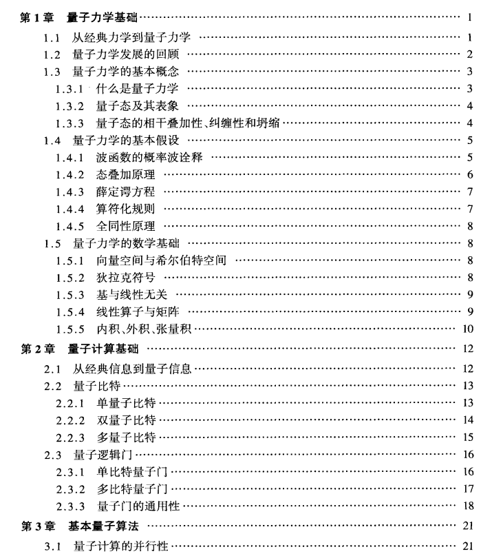
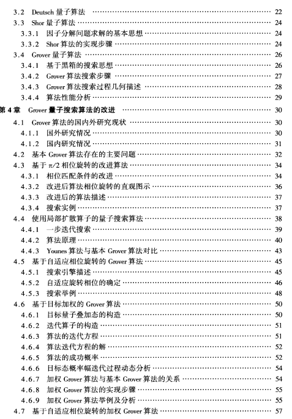
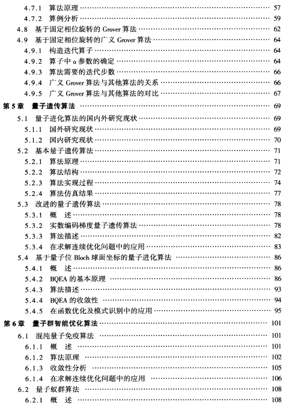
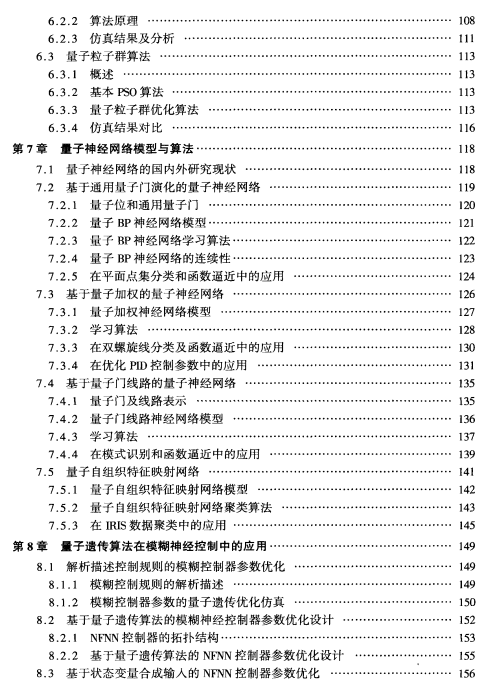
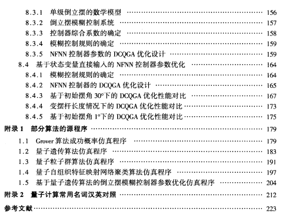

# 读书笔记

## 书名: 《量子计算与量子优化算法》 
## 作者: 李士勇 李盼池

### 阅读前的感悟
人工智能是在沉寂了三十多年之后，才焕发了今天这样的生机。在我们选择专业，研究方向之前不知道她是否会有多大的辉煌，只有热爱一门学科，坚持去研究，等待其他领域的发展跟上来时，守得云开见月明。
我想量子计算和优化算法也是一样，在没有成本低高效可靠的量子计算机出来之前就是被藏在地下的金子。

### 目录

...

### 每章内容

#### 第一章: 量子力学基础
- **摘要**: 主要讲述阅读的目的和重要性，提出了不同层次的阅读方式。
- **关键概念和定义**
  - **基础阅读**: 初级的阅读能力，主要是识字和理解句子。
  - **分析阅读**: 深入理解书籍内容，能够进行批判性思考。
- **重要引用和段落**
  - “阅读是一种通过眼睛和大脑进行的艺术。”（第5页）
- **图表和示例**
  - （这里可以画出或描述一些书中提到的阅读方法图示）
- **个人思考和疑问**
  - 如何更有效地进行分析阅读？是否有具体的方法和工具？

#### 第二章: 阅读的层次
- **摘要**: 介绍了四个层次的阅读：基础阅读、检视阅读、分析阅读和主题阅读。
- **关键概念和定义**
  - **检视阅读**: 快速浏览书籍内容，获取总体理解。
  - **主题阅读**: 综合多本书籍进行主题性研究。
- **重要引用和段落**
  - “检视阅读是一种快速获取书籍全貌的方法。”（第30页）
- **图表和示例**
  - （这里可以描述或画出检视阅读和主题阅读的步骤图）
- **个人思考和疑问**
  - 在实际阅读中，如何有效区分并应用不同的阅读层次？

### 总结和反思
这本书通过系统地介绍阅读方法，帮助读者提高了阅读效率和理解能力。最重要的收获是认识到不同阅读层次的重要性，以及如何在不同情境下灵活应用这些方法。

### 相关文献
- 《如何阅读一本书》中提到的其他重要文献列表。
